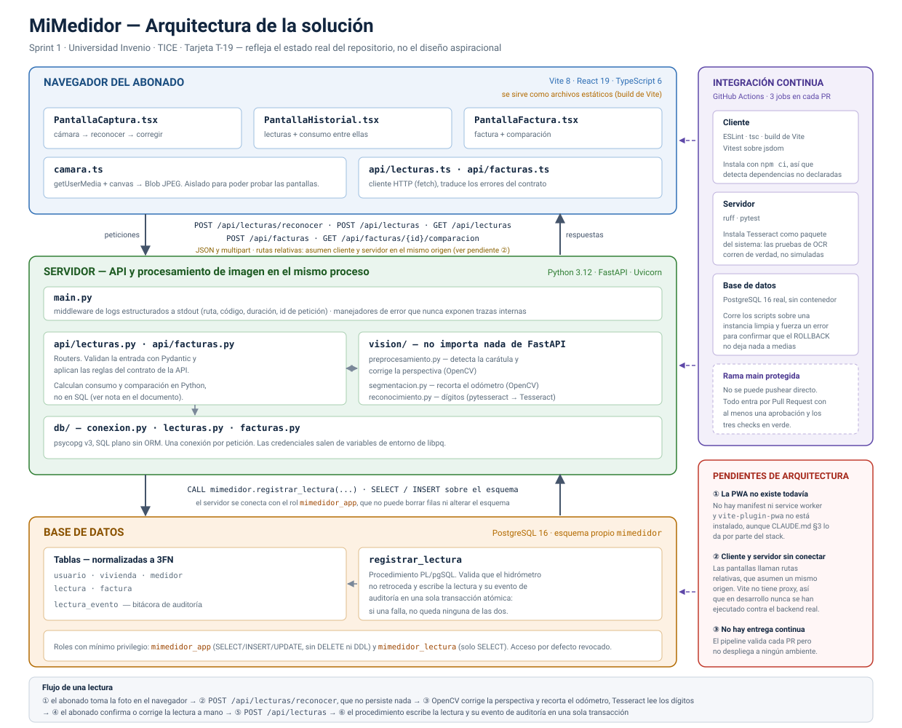

# Arquitectura de la solución — MiMedidor

**Tarjeta:** T-19 · **Sprint:** 1 · **Estado:** propuesta para revisión del equipo.

Este documento y el diagrama que lo acompaña describen **la arquitectura que existe hoy en el
repositorio**, no la que quisiéramos tener. Donde algo está declarado pero no construido, se dice
explícitamente en la §6 en vez de dibujarlo como si funcionara.

> El diagrama vive en [`arquitectura.svg`](arquitectura.svg). Es SVG escrito a mano, no exportado
> de una herramienta: eso lo hace versionable (git muestra qué cambió, línea por línea) y evita
> depender de un archivo binario que solo una persona puede volver a abrir. Para modificarlo se
> edita el SVG directamente.

---

## 1. Vista general

La solución tiene tres capas de ejecución y una de validación:

| Capa | Qué corre ahí | Tecnologías |
|---|---|---|
| Navegador del abonado | Las tres pantallas del hilo funcional y el acceso a la cámara | Vite 8, React 19, TypeScript 6 |
| Servidor | La API y el procesamiento de imagen, **en el mismo proceso** | Python 3.12, FastAPI, Uvicorn, OpenCV, Tesseract vía `pytesseract` |
| Base de datos | Persistencia, reglas transaccionales y control de acceso | PostgreSQL 16, PL/pgSQL, `psycopg` v3 |
| Integración continua | Valida las tres capas anteriores en cada Pull Request | GitHub Actions |

---

## 2. Navegador del abonado

Aplicación de una sola página construida con Vite y servida como archivos estáticos.

| Módulo | Responsabilidad |
|---|---|
| `PantallaCaptura.tsx` | Abre la cámara, guía el encuadre, envía la foto, permite **corregir** la lectura antes de confirmarla |
| `PantallaHistorial.tsx` | Lista las lecturas del medidor y el consumo entre lecturas consecutivas |
| `PantallaFactura.tsx` | Registra una factura a mano y muestra la comparación contra las lecturas propias |
| `camara.ts` | Único punto que toca `getUserMedia` y `canvas` |
| `api/lecturas.ts`, `api/facturas.ts` | Cliente HTTP con `fetch`; traducen `{"error": {...}}` del contrato a excepciones tipadas |

**Por qué `camara.ts` está separado.** `jsdom` — el entorno donde corren las pruebas — no tiene
cámara ni `canvas` reales. Aislando ese acceso en un módulo propio, las pruebas de las pantallas
lo sustituyen por completo y prueban la lógica de estados (reconociendo → revisando → guardando)
sin depender de hardware. Si el acceso a la cámara estuviera mezclado dentro del componente, esa
lógica no sería comprobable.

---

## 3. Servidor

Un solo proceso de FastAPI sirve la API **y** ejecuta el procesamiento de imagen.

| Módulo | Responsabilidad |
|---|---|
| `main.py` | Middleware de logs estructurados a stdout y manejadores de error centralizados |
| `api/lecturas.py`, `api/facturas.py` | Routers: validan la entrada con Pydantic y aplican las reglas del contrato |
| `vision/preprocesamiento.py` | Detecta la carátula del hidrómetro y corrige la perspectiva (OpenCV) |
| `vision/segmentacion.py` | Recorta la ventana del odómetro (OpenCV) |
| `vision/reconocimiento.py` | Lee los dígitos (`pytesseract` → Tesseract) |
| `db/conexion.py`, `db/lecturas.py`, `db/facturas.py` | Acceso a datos con `psycopg` v3, SQL plano |

**Por qué la visión vive en el mismo proceso y no en un microservicio.** El corazón del proyecto
(T-09 → T-10 → T-11) es OpenCV y OCR, que en Python son una función más. Separarlo en un servicio
aparte habría agregado despliegue, red y modos de fallo nuevos, sin nada a cambio en un sprint de
diez días.

**Por qué `vision/` no importa nada de FastAPI.** Son funciones puras: reciben un arreglo de
imagen y devuelven un resultado. Así se prueban con `pytest` sin levantar el servidor, y el
trabajo que evalúa Computación Gráfica queda demostrable por separado.

**Por qué los logs nunca llevan la imagen ni datos del abonado.** Cada petición registra momento,
ruta, método, código de respuesta, duración e identificador de petición — lo suficiente para
diagnosticar sin convertir el log en un depósito de datos personales.

**Nunca se exponen trazas internas al cliente.** El manejador de error general registra el detalle
completo en el log y devuelve al cliente solo `ERROR_INTERNO`.

### Una deuda que conviene tener presente

`docs/architecture/modelo-datos.md` §3 previó resolver el consumo entre lecturas y la comparación
contra factura con una vista (`vista_historial_lecturas`) y una función (`fn_comparacion_factura`).
**Ninguna de las dos llegó a escribirse en T-13**, así que los routers calculan ambas cosas en
Python. Funciona y está probado, pero es una diferencia real entre el modelo documentado y el
implementado. Está anotada en `docs/deuda-tecnica.md` para resolverla en el Sprint 2.

---

## 4. Base de datos

PostgreSQL 16 con un esquema propio, `mimedidor`, en lugar de `public`.

- **Tablas** (normalizadas a 3FN): `usuario`, `vivienda`, `medidor`, `lectura`, `factura`, más
  `lectura_evento` como bitácora de auditoría.
- **Procedimiento `registrar_lectura`** (PL/pgSQL): valida que el hidrómetro no retroceda y
  escribe la lectura junto con su evento de auditoría **en una sola transacción atómica**. Si
  cualquiera de las dos escrituras falla, no queda ninguna de las dos.
- **Roles con mínimo privilegio**: `mimedidor_app` (SELECT/INSERT/UPDATE, sin DELETE ni DDL) y
  `mimedidor_lectura` (solo SELECT). El acceso por defecto al esquema está revocado.

**Por qué SQL plano y no un ORM.** La rúbrica de Base de Datos exige procedimientos almacenados,
roles con mínimo privilegio y control transaccional escritos por nosotros. Un ORM esconde
exactamente lo que hay que poder mostrar y defender.

**Por qué el backend se conecta con un rol que no puede borrar.** Ningún flujo del contrato de la
API borra filas. Si esa credencial se filtrara, quien la tuviera no podría destruir el historial
ni alterar el esquema.

---

## 5. Integración continua

GitHub Actions corre tres jobs en cada Pull Request:

| Job | Qué hace |
|---|---|
| Cliente | ESLint, `tsc`, build de Vite y Vitest. Instala con `npm ci`, así que detecta dependencias usadas pero no declaradas |
| Servidor | `ruff` y `pytest`. Instala Tesseract como paquete del sistema, así que las pruebas de OCR corren de verdad |
| Base de datos | Levanta PostgreSQL 16 real, corre los scripts sobre una instancia limpia y **fuerza un error a propósito** para confirmar que el `ROLLBACK` no deja nada a medias |

`main` está protegida: no se puede pushear directo, y todo entra por Pull Request con al menos una
aprobación y los tres checks en verde.

---

## 6. Lo que el diagrama marca como pendiente

Estos tres puntos aparecen en rojo en el diagrama a propósito. Son diferencias reales entre lo
declarado y lo construido, y alimentan directamente los riesgos del Sprint 2 (T-20).

### ① La PWA no existe todavía

`vite-plugin-pwa` **no está instalado**: no hay manifest, no hay service worker, y el build no
genera ninguno. Hoy la aplicación es una SPA normal. La decisión de PWA sobre nativo (T-01) sigue
siendo válida y el trabajo pendiente es acotado, pero mientras no se haga, llamarla PWA sería
inexacto.

`CLAUDE.md` §3 llegó a listar el plugin como parte del stack; se corrigió al detectarlo, y el
riesgo quedó anotado en su §13.5.

### ② Cliente y servidor no se han ejecutado juntos

`api/lecturas.ts` y `api/facturas.ts` llaman rutas relativas (`/api/…`), lo que asume que cliente
y servidor se sirven desde el mismo origen. En producción eso se cumpliría; **en desarrollo no**,
porque Vite y Uvicorn escuchan en puertos distintos y `vite.config.ts` no tiene un proxy
configurado.

Consecuencia honesta: cada capa está probada por separado — las pantallas contra un módulo de API
sustituido, y los endpoints contra una conexión de base de datos sustituida — pero **el hilo
completo nunca se ha ejecutado de punta a punta contra el backend real**. Cerrarlo es
razonablemente pequeño (un `server.proxy` en `vite.config.ts`) y debería ser lo primero del
Sprint 2, antes de cualquier funcionalidad nueva.

### ③ No hay entrega continua

El pipeline valida cada Pull Request pero no despliega a ningún ambiente. La rúbrica de Ingeniería
de Software II pide un pipeline de entrega continua, así que esto queda como pendiente explícito.

---

## 7. Aprobación

| Integrante | Revisó | Comentarios |
|---|---|---|
| José Pablo Ramírez Sánchez | ✅ (autor de la propuesta) | |
| Isaac Felipe Morún Moreira | ⬜ | |
| Yariel Andrey Elizondo Jiménez | ⬜ | |
