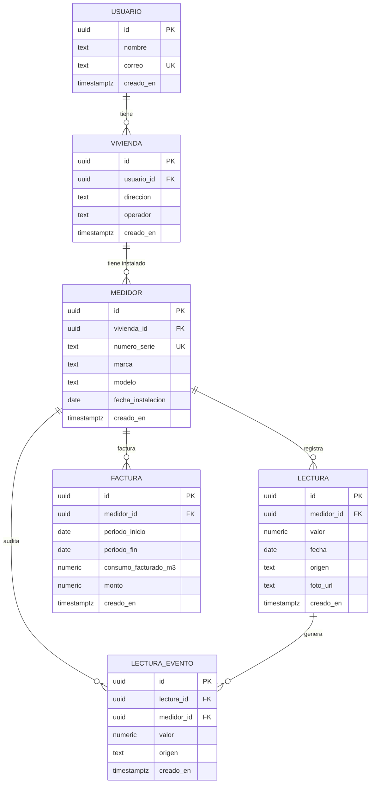

# Modelo de datos — MiMedidor

**Tarjeta:** T-12 · **Estado:** propuesta para revisión de los tres integrantes.

Este documento es la fuente de verdad del modelo entidad-relación. Los scripts de
`database/scripts/` (T-13) implementan exactamente lo que está acá — si algo cambia en el
esquema real, este documento se actualiza en el mismo PR.

Entidades mínimas definidas en `CLAUDE.md` §6: `usuario`, `vivienda`, `medidor`, `lectura`,
`factura`. Motor: PostgreSQL (T-02a). Todas las claves primarias son `uuid` generado por la
aplicación o por `gen_random_uuid()`, para no exponer un conteo secuencial de filas y para que
coincidan con los `id` que ya usa el contrato de la API (`docs/architecture/contrato-api.md`).

---

## 1. Diagrama entidad-relación

---

## 2. Diccionario de datos

### `usuario`

| Columna | Tipo | Restricción | Nota |
|---|---|---|---|
| `id` | `uuid` | PK | |
| `nombre` | `text` | `NOT NULL` | |
| `correo` | `text` | `NOT NULL UNIQUE` | Sin autenticación este sprint (P-15, fuera de alcance); se guarda igual porque identifica al abonado de forma única |
| `creado_en` | `timestamptz` | `NOT NULL DEFAULT now()` | |

### `vivienda`

| Columna | Tipo | Restricción | Nota |
|---|---|---|---|
| `id` | `uuid` | PK | |
| `usuario_id` | `uuid` | `NOT NULL`, `FK → usuario(id)` | |
| `direccion` | `text` | `NOT NULL` | |
| `operador` | `text` | `NOT NULL`, `CHECK (operador IN ('AyA','ASADA','Municipalidad'))` | Quién le factura al abonado — necesario para el contraste de T-18 |
| `creado_en` | `timestamptz` | `NOT NULL DEFAULT now()` | |

### `medidor`

| Columna | Tipo | Restricción | Nota |
|---|---|---|---|
| `id` | `uuid` | PK | |
| `vivienda_id` | `uuid` | `NOT NULL`, `FK → vivienda(id)` | |
| `numero_serie` | `text` | `NOT NULL UNIQUE` | Serie física grabada en el hidrómetro |
| `marca` | `text` | `NOT NULL` | Clave para el riesgo de fragmentación del parque de medidores (`CLAUDE.md` §13): si una marca aparece en ≥60 % del dataset de campo, el MVP se acota a ella |
| `modelo` | `text` | `NULL` | |
| `digitos_decimales` | `smallint` | `NOT NULL DEFAULT 0`, `CHECK (0..3)` | Cuántos dígitos marca en rojo el odómetro, o sea la fracción de m³ (T-39). **Es una propiedad física de este aparato, no una constante del sistema**: en el dataset de campo el ARAD tiene 1 y el ACTARIS 2. Sin ella la lectura se guardaría inflada ×10 o ×100 según el modelo, y la comparación contra factura —que viene en m³ reales— no significaría nada |
| `fecha_instalacion` | `date` | `NULL` | No siempre se conoce en campo |
| `creado_en` | `timestamptz` | `NOT NULL DEFAULT now()` | |

### `lectura`

| Columna | Tipo | Restricción | Nota |
|---|---|---|---|
| `id` | `uuid` | PK | |
| `medidor_id` | `uuid` | `NOT NULL`, `FK → medidor(id)` | |
| `valor` | `numeric(10,2)` | `NOT NULL`, `CHECK (valor >= 0)` | Un hidrómetro no retrocede; la validación contra la lectura anterior es de negocio, no un `CHECK` de una sola fila — vive en el procedimiento de T-14 |
| `fecha` | `date` | `NOT NULL` | |
| `origen` | `text` | `NOT NULL`, `CHECK (origen IN ('reconocimiento','manual'))` | Es el dato que permite calcular la exactitud real en T-11 |
| `foto_url` | `text` | `NULL` | |
| `creado_en` | `timestamptz` | `NOT NULL DEFAULT now()` | |

### `factura`

| Columna | Tipo | Restricción | Nota |
|---|---|---|---|
| `id` | `uuid` | PK | |
| `medidor_id` | `uuid` | `NOT NULL`, `FK → medidor(id)` | |
| `periodo_inicio` | `date` | `NOT NULL` | |
| `periodo_fin` | `date` | `NOT NULL`, `CHECK (periodo_fin > periodo_inicio)` | |
| `consumo_facturado_m3` | `numeric(10,2)` | `NOT NULL` | |
| `monto` | `numeric(12,2)` | `NOT NULL` | Colones costarricenses, sin símbolo (igual que el contrato de la API) |
| `creado_en` | `timestamptz` | `NOT NULL DEFAULT now()` | |

### `lectura_evento`

Bitácora de auditoría: registra cada lectura que el procedimiento de T-14 confirmó y guardó.
Nace de la decisión de §5.2 (Opción C) — ver esa sección para la justificación completa.

| Columna | Tipo | Restricción | Nota |
|---|---|---|---|
| `id` | `uuid` | PK | |
| `lectura_id` | `uuid` | `NOT NULL`, `FK → lectura(id)` | |
| `medidor_id` | `uuid` | `NOT NULL`, `FK → medidor(id)` | Se podría derivar vía `lectura_id → lectura.medidor_id`, pero se guarda explícito a propósito: es una tabla de auditoría y tiene que poder consultarse por medidor aunque `lectura` cambie de forma en el futuro (ver justificación en §5.2) |
| `valor` | `numeric(10,2)` | `NOT NULL` | Valor tal como quedó registrado en el momento del evento |
| `origen` | `text` | `NOT NULL` | Copia del `origen` de la lectura en el momento del evento |
| `creado_en` | `timestamptz` | `NOT NULL DEFAULT now()` | |

En este sprint se genera exactamente un evento por lectura exitosa (el registro). El diseño no
impide más de un evento por lectura en sprints futuros (ej. una corrección), por eso la relación
es `1:N` y no `1:1`.

---

## 3. Qué campos del contrato de API NO son columnas

`docs/architecture/contrato-api.md` expone `consumo_desde_anterior_m3` y `dias_desde_anterior`
en `GET /api/lecturas`, y `consumo_medido_m3` / `diferencia_m3` / `diferencia_porcentual` /
`supera_umbral` en `GET /api/facturas/{id}/comparacion`. Ninguno de los dos se guarda como
columna: son valores que dependen de **otras filas** de la misma tabla (la lectura anterior del
mismo medidor, o las lecturas dentro del período de una factura), y guardarlos sería redundancia
calculada — se desincroniza en cuanto alguien corrige una lectura a mano.

> **Corrección (T-34, 2026-08-27):** esta sección decía que ambos se resolvían con una vista y
> una función de PL/pgSQL escritas en T-13. Eso nunca se implementó — quedó como deuda técnica
> registrada en `docs/deuda-tecnica.md` hasta que se cerró acá. Lo que sigue es lo que
> **realmente existe** en el código.

Los dos se calculan en **Python**, dentro de los routers, sobre las filas ya ordenadas que trae
una consulta simple:

- `consumo_desde_anterior_m3` / `dias_desde_anterior` — `server/app/api/lecturas.py::listar_historial`,
  recorriendo secuencialmente lo que devuelve `app/db/lecturas.py::listar_lecturas` (equivalente
  a lo que haría `LAG()` en SQL, pero en un `for` de Python).
- `consumo_medido_m3` / `diferencia_m3` / `diferencia_porcentual` / `supera_umbral` —
  `server/app/api/facturas.py::comparar_factura`, a partir de dos llamadas a
  `app/db/facturas.py::lectura_mas_reciente_hasta` (la lectura vigente al inicio y al fin del
  período de la factura).

**Por qué se decidió dejarlo así y no escribir la vista/función que describía este documento**
(Issue [#44](https://github.com/NieblaVidente/mimedidor/issues/44), T-34): para cuando se
detectó la contradicción, ambos cálculos ya estaban implementados en Python, con cobertura de
prueba completa (`server/tests/test_historial.py`, `test_facturas.py`) y verificados de punta a
punta por la prueba end-to-end de Cypress (T-22). Reescribirlos como objetos de PostgreSQL y
migrar los routers para que los consulten es un cambio real de arquitectura, no solo mover
código — y hacerlo esta semana, a días de la entrega y sin beneficio funcional para quien usa la
aplicación (el resultado es idéntico), es más riesgo de romper algo que ya funciona y está
probado que beneficio. La razón original de §3 (evitar repetir la misma lógica en dos lugares)
sigue siendo válida en principio — queda anotada como mejora deseable para un sprint futuro, no
como algo urgente.

Lo que **no** se aceptó fue dejar la contradicción sin resolver: este documento tiene que
describir lo que el código hace de verdad, y ahora lo hace.

---

## 4. Justificación de normalización (3FN)

**1FN** — todas las columnas son atómicas (sin arreglos ni grupos repetidos) y cada tabla tiene
una clave primaria de un solo valor (`uuid`). Se cumple en las cinco tablas.

**2FN** — al ser todas las claves primarias de una sola columna (`uuid` generado, no compuesta),
no existe la posibilidad de dependencia parcial: cualquier atributo no-clave depende de la
totalidad de la clave por construcción. Se cumple trivialmente.

**3FN** — ningún atributo no-clave depende de otro atributo no-clave (dependencia transitiva):

- `usuario`: `nombre` y `correo` dependen únicamente de `id`.
- `vivienda`: `direccion` y `operador` dependen únicamente de `id`, no de `usuario_id`.
- `medidor`: `numero_serie`, `marca`, `modelo`, `digitos_decimales` y `fecha_instalacion`
  dependen únicamente de `id`, no de `vivienda_id`. `digitos_decimales` **no** viola 3FN aunque
  se correlacione con la marca: es una característica del aparato instalado, y un mismo
  fabricante vende modelos con distinta cantidad de dígitos rojos. Derivarla de `marca` sería
  suponer una dependencia que no existe.
- `lectura`: `valor`, `fecha`, `origen`, `foto_url` dependen únicamente de `id`. Ver §3 — el
  campo derivable (`consumo_desde_anterior_m3`) se excluyó a propósito porque depende de otra
  fila, no de esta clave.
- `factura`: mismo razonamiento — `consumo_medido_m3` y la comparación se excluyeron por
  depender de filas de `lectura`, no de la clave de `factura`.
- `lectura_evento`: es la única tabla con redundancia deliberada (`medidor_id` y `valor` son
  derivables vía `lectura_id`). Se documenta y justifica en §5.2 como excepción intencional de
  tabla de auditoría, no como un descuido de diseño.

---

## 5. Decisiones de diseño — acordadas por los tres el 2026-08-13

### 5.1 `operador` (AyA / ASADA / Municipalidad): en `vivienda`

**Qué significa el campo:** quién le emite la factura al abonado. Es lo que permite que T-18
sepa contra qué operador contrastar el consumo.

**Decisión: `vivienda`.** El servicio de agua en Costa Rica se asigna por **territorio
geográfico**: una zona la cubre AyA, otra una ASADA local, otra la municipalidad — es un dato de
la ubicación, no del aparato.

- Si el AyA/ASADA cambia el hidrómetro físico (pasa seguido, es parte del problema que motiva el
  proyecto — ver `CLAUDE.md` §1), el operador no cambia. Ponerlo en `medidor` habría obligado a
  copiarlo cada vez que se reemplaza el aparato, con riesgo de que alguien lo copie mal.
- Si una vivienda llega a tener dos medidores (ej. uno de la casa y otro de un tanque/jardín
  aparte), ambos comparten operador porque comparten dirección — guardarlo en `vivienda` lo
  garantiza por diseño.
- Es más defendible frente a 3FN: como todos los medidores de una vivienda comparten operador,
  ponerlo en `medidor` habría sido una dependencia transitiva real
  (`medidor_id → vivienda_id → operador`), no solo un matiz de estilo.

No apareció en el dataset de campo (T-07/T-08) ningún caso de una vivienda con medidores de
operadores distintos, así que no hay excepción que documentar. Si aparece en Sprint 2, se
reabre esta decisión.

---

### 5.2 Auditoría de registro de lecturas para T-14: Opción C — tabla `lectura_evento`

La tarjeta T-14 pide que el procedimiento haga **dos escrituras atómicas**: insertar la lectura
y dejar evidencia del consumo/evento calculado, de forma que si cualquiera de las dos falla, no
quede nada a medias. Se evaluaron tres formas de lograrlo (caché en `medidor`, tabla de
auditoría aparte, o no hacerlo) y **se eligió la tabla de auditoría aparte (`lectura_evento`,
§2)**, no el caché.

Por qué no el caché en `medidor` (`ultima_lectura_valor`/`fecha`): habría sido una redundancia
sin propósito propio — solo existiría para acelerar una validación, y sería 100 % derivable de
`lectura` en todo momento. Cualquier corrección futura de una lectura (Sprint 2) obligaría a
mantenerlo sincronizado a mano o con un trigger, más superficie de bug para lo que gana.

Por qué sí `lectura_evento`: las tablas de auditoría son la excepción de normalización más
aceptada en la práctica — su función explícita es preservar el estado histórico de un evento
("esta lectura se registró, con este valor y origen, en este momento"), independientemente de
si la fila de origen cambia más adelante. No es redundancia accidental, es el propósito de la
tabla. El procedimiento de T-14 hace `INSERT` en `lectura` **y** `INSERT` en `lectura_evento`
dentro de la misma transacción — si el segundo falla, el primero también se revierte, que es la
demostración real de `ROLLBACK` que pide la rúbrica de Base de Datos. Como beneficio adicional,
cubre el extra que la rúbrica reconoce positivamente ("implementaciones adicionales
relacionadas con... auditoría").

---

## 6. Aprobación

| Integrante | Revisó | Comentarios |
|---|---|---|
| Isaac Felipe Morún Moreira | ✅ (autor de la propuesta) | |
| José Pablo Ramírez Sánchez | ✅ | Revisado 2026-08-18 |
| Yariel Andrey Elizondo Jiménez | ✅ | Revisado 2026-08-25, en la sesión presencial del equipo |

**Aprobado por los tres.** El modelo queda congelado, igual que el contrato de la API en T-04b: si
alguien necesita cambiarlo, se abre una tarea aparte y se avisa al resto, no se edita por cuenta
propia.

Con esto T-12 cumple el punto 6 del Definition of Done, que era el único incumplimiento que
quedaba abierto del Sprint 1.
