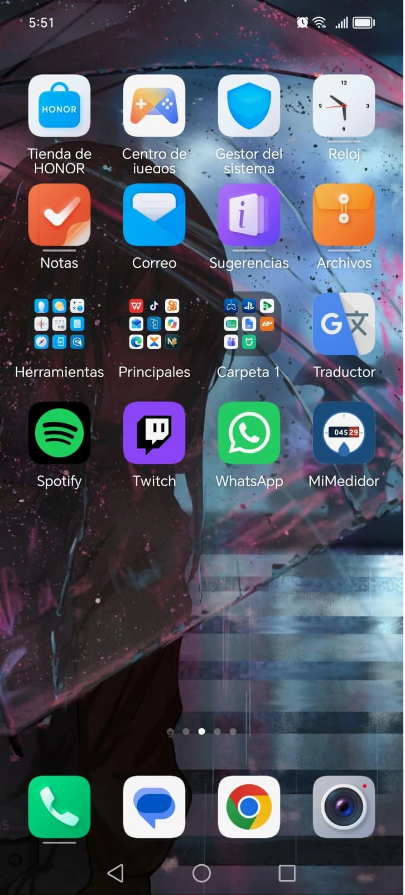
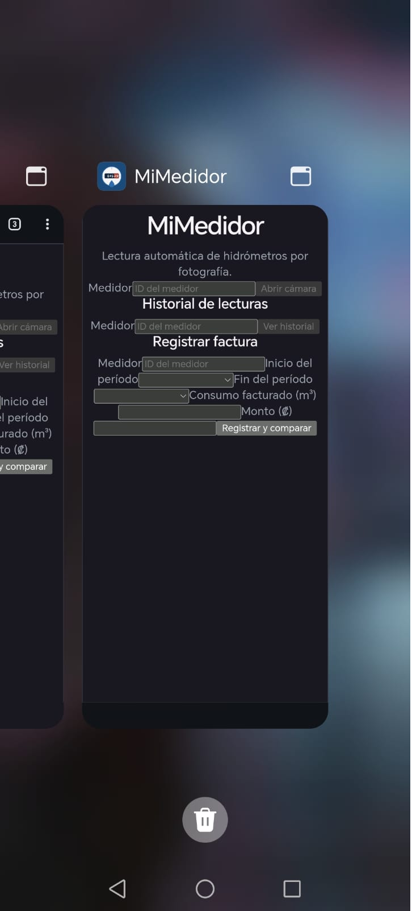

# Evidencia: la PWA se instala en un teléfono real — T-31

El criterio de aceptación de [T-31](https://github.com/NieblaVidente/mimedidor/issues/41) pedía
**«comprobado que se puede instalar de verdad en un teléfono, no solo que el manifest existe»**.
Este documento es esa comprobación.

**Fecha:** 6 de setiembre de 2026 · **Dispositivo:** Android (HONOR) · **Navegador:** Chrome

---

## Por qué el manifest no alcanzaba como prueba

Un manifest con un icono del tamaño equivocado, o servido con el tipo MIME incorrecto, **pasa
cualquier validación de build sin quejarse** y aun así el navegador nunca ofrece instalar. Por eso
la tarjeta pedía la comprobación en un aparato real y no la existencia del archivo.

## Cómo se probó, y por qué costó

Un trabajador de servicio **no se registra sobre HTTP**: el navegador solo lo permite en HTTPS o en
`localhost`. Abrir la aplicación desde el teléfono por la IP de la red local (`http://192.168.…`)
no sirve — el navegador la trata como contexto inseguro y no ofrece instalar.

Como el proyecto **todavía no tiene servidor** (T-28, #38), se sirvió el build por un túnel HTTPS
temporal, se hizo la prueba y se apagó enseguida.

> **Esto es una dependencia real, no una anécdota.** Verificar la PWA requirió resolver a mano lo
> que T-28 va a resolver de forma permanente. Mientras no exista el ambiente desplegado, cualquier
> prueba en un dispositivo real va a necesitar este rodeo.

## Evidencia

### 1 · Instalada en la pantalla de inicio

El icono aparece entre las demás aplicaciones, con el icono propio del proyecto — el odómetro con
los dígitos rojos, que es la misma convención que documenta T-39.

### 2 · Corre como aplicación, no como acceso directo

**Esta es la captura que cierra el criterio.** En el selector de aplicaciones recientes, MiMedidor
tiene **tarjeta propia, con su nombre y su icono, separada de la de Chrome** (visible a la
izquierda). Y la aplicación se muestra **sin la barra de direcciones del navegador**.

Un acceso directo se abriría dentro de Chrome y no tendría tarjeta propia. Esto es modo
`standalone`, que es lo que declara el manifest.

## Lo que además quedó comprobado

- El **selector de fecha** que agregó T-35 (#52) funciona con el diálogo nativo de Android.
- El icono se distingue a tamaño real en la pantalla de inicio.

## Un defecto que apareció al hacer esta prueba

**El formulario está mal maquetado en pantalla de teléfono.** Las etiquetas se superponen con los
campos: «Medidor» pegado a su campo y al botón, «Inicio del período» partido en dos líneas,
«Consumo facturado» encimado con el selector.

Importa más de lo que parece: el caso de uso del producto es **alguien agachado sobre una caja de
medidor en el patio, con el teléfono en la mano**. No hay otro escenario. Y es un defecto que no se
ve en una computadora — apareció justo por probar en el dispositivo real.

Queda registrado como tarjeta aparte.
