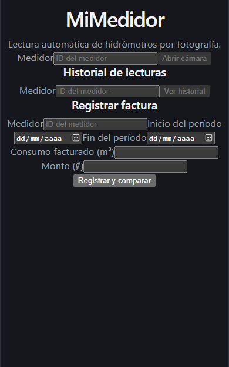
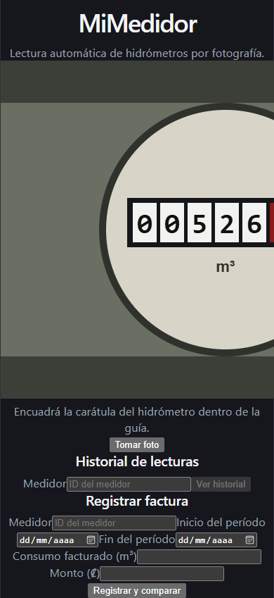
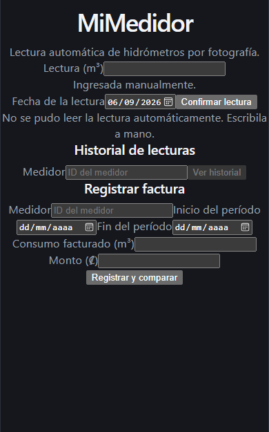
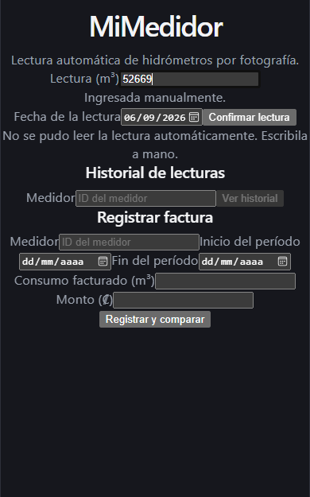
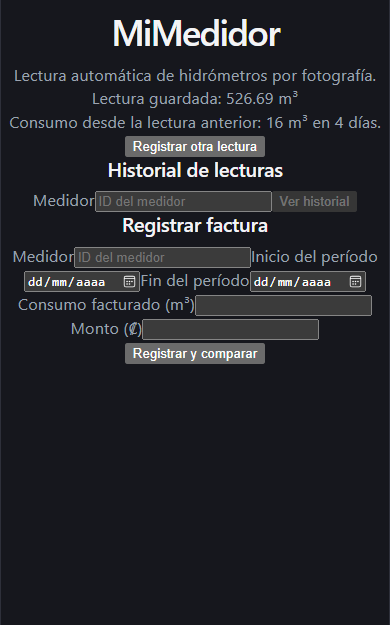
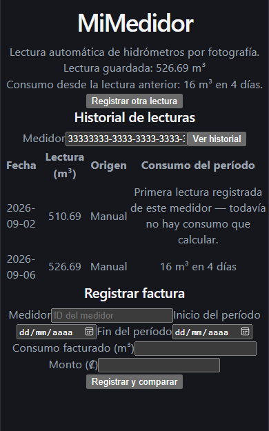
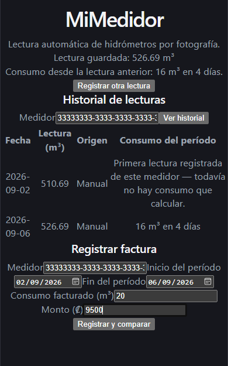
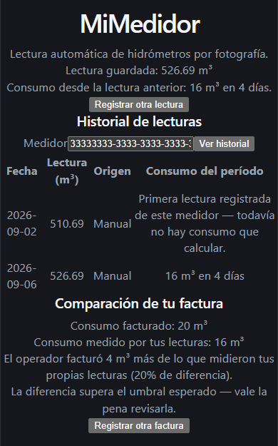

# Manual de usuario — MiMedidor

**Para el abonado.** No hace falta saber nada de programación para leer esto.

MiMedidor sirve para tres cosas:

1. **Anotar la lectura de su medidor de agua** tomándole una foto.
2. **Llevar el historial** de sus propias lecturas y ver cuánta agua gastó entre una y otra.
3. **Comparar ese consumo contra el que le cobra la factura**, para saber si la diferencia es
   grande.

Todo desde el celular, sin comprar ningún aparato.

> ### Lo primero, y lo más importante
>
> **La aplicación se equivoca casi siempre al leer el número de la foto.** No es un problema
> pasajero: en las pruebas de campo acertó **0 de 5 veces**.
>
> Por eso la aplicación **nunca guarda nada sin mostrárselo antes**. Usted revisa el número,
> lo corrige si está mal, y recién ahí confirma. Corregir a mano no es que algo salió mal:
> **es el modo normal de usarla hoy.**
>
> Todo este manual está escrito con eso en mente.

---

## Antes de empezar: el identificador de su medidor

Para todo lo que sigue hace falta un **identificador del medidor**: un código largo con guiones,
parecido a `33333333-3333-3333-3333-333333333333`.

**En esta versión usted no puede obtenerlo por su cuenta.** La aplicación todavía no tiene una
pantalla para dar de alta un medidor, así que el código se lo tiene que entregar quien
administra el sistema. Anótelo una vez y téngalo a mano: hay que escribirlo en las tres
secciones.

Es la limitación más grande de esta versión y está anotada como pendiente.

---

## 1. Registrar una lectura

### Paso 1 — Escriba el identificador y abra la cámara

Escriba el identificador en el campo **Medidor**. El botón **Abrir cámara** está apagado hasta
que el campo tenga algo escrito.

La primera vez, el navegador le va a preguntar si permite usar la cámara. Hay que decir que sí:
sin cámara no se puede continuar.

### Paso 2 — Encuadre la carátula y tome la foto

Apunte a la **carátula redonda** del medidor, la que tiene los números.

Consejos que salieron de las fotos que tomamos en campo, donde la mayoría de los medidores está
en una caja de concreto a ras del suelo:

- **Acérquese.** Que la carátula ocupe la mayor parte posible de la pantalla. La foto de un
  medidor donde se ve toda la caja y la carátula queda chiquita es la que peor funciona.
- **De frente.** Agacharse y disparar desde arriba en ángulo hace que los números salgan
  deformados.
- **Limpie el vidrio** si tiene tierra o está empañado.
- **Cuidado con el flash y con el reflejo del sol.** El vidrio rebota la luz justo sobre los
  números.

> **Sobre la frase «dentro de la guía» que aparece en pantalla.** La aplicación dice
> «Encuadrá la carátula del hidrómetro dentro de la guía», pero **en esta versión esa guía no se
> dibuja**. Ignore la frase y encuadre a ojo. Está reportado como error.

Cuando esté listo, toque **Tomar foto**.

### Paso 3 — Revise el número. Este es el paso importante

Después de la foto la aplicación intenta leer el número y le muestra el resultado para que usted
lo revise.

**Casi siempre va a pasar esto:** no pudo leerlo, el campo queda vacío y aparece el aviso
*«No se pudo leer la lectura automáticamente. Escribila a mano.»*

No es un error suyo ni de la foto. Escriba el número usted.

#### Qué número escribir exactamente

**Escriba los dígitos tal como los ve en la carátula, todos seguidos y sin punto ni coma.**

Si el odómetro muestra `0052669`, usted escribe **`52669`** (los ceros de adelante no hacen
falta). No escriba `526,69` ni `526.69`: la aplicación se encarga de poner el punto donde va,
porque sabe cuántos dígitos rojos tiene su medidor.

**Los dígitos rojos** (o los que están sobre fondo rojo, o después de una coma) son **fracciones
de metro cúbico** — litros, en la práctica. Casi todos los medidores tienen uno o dos. Usted no
tiene que hacer ninguna cuenta: escríbalos igual que los demás.

En el ejemplo de este manual el medidor tiene **dos dígitos rojos**, así que al escribir `52669`
la aplicación va a guardar **526,69 m³**.

> **Ojo con el rótulo del campo.** Dice **«Lectura (m³)»**, y eso confunde: lo que usted escribe
> **no** son metros cúbicos, son los dígitos de la carátula. Está reportado para corregirlo.

#### Si el número que salió está mal

Este es el caso más común, así que va explicado aparte.

| Lo que ve | Qué hacer |
|---|---|
| **El campo quedó vacío** con el aviso de que no se pudo leer | Escriba el número usted. Es lo normal |
| **Salió un número, pero no es el que dice su medidor** | Bórrelo y escriba el correcto. No lo confirme «por si acaso» |
| **Salió un número con más o menos dígitos** de los que tiene su carátula | Está mal seguro. Corríjalo |
| **No está seguro de haber leído bien la carátula** | Vuelva al medidor y mírelo otra vez antes de confirmar |

Debajo del campo la aplicación le dice de dónde salió el número:

- *«Lectura reconocida automáticamente — revisala antes de confirmar.»* → lo puso la aplicación.
  **Revíselo.**
- *«Ingresada manualmente.»* → lo escribió usted. En cuanto usted toca el número, cambia a esto.

**Es preferible corregir el número antes que confirmarlo mal.** Una lectura equivocada le
descuadra el historial y la comparación con la factura, que es justamente para lo que sirve
guardarla.

#### La fecha

Viene puesta la de hoy y se puede cambiar, porque lo normal es tomar la foto en el patio y
registrarla después. **No se puede poner una fecha futura.**

Cuando el número y la fecha estén bien, toque **Confirmar lectura**.

### Paso 4 — Listo

La aplicación le confirma **la lectura ya convertida a metros cúbicos** —acá se ve el `526.69`
que salió de escribir `52669`— y, si ya tenía una lectura anterior, **cuánta agua gastó desde
entonces y en cuántos días**.

Si es su primera lectura de ese medidor no aparece consumo: no hay con qué compararla todavía.
A partir de la segunda sí.

---

## 2. Ver su historial

En **Historial de lecturas** escriba otra vez el identificador y toque **Ver historial**.

La tabla muestra, de la más vieja a la más nueva:

| Columna | Qué significa |
|---|---|
| **Fecha** | El día de la lectura |
| **Lectura (m³)** | El valor del medidor ese día, ya en metros cúbicos |
| **Origen** | **Manual** si lo escribió usted, **Reconocimiento automático** si lo leyó la aplicación y usted lo dejó igual |
| **Consumo del período** | Cuánta agua se gastó desde la lectura anterior, y en cuántos días |

La columna **Origen** sirve para saber de cuáles lecturas fiarse más. Hoy casi todas van a decir
*Manual*, y eso está bien.

---

## 3. Comparar contra su factura

Acá es donde la aplicación le sirve de verdad: le dice si lo que le cobraron se parece a lo que
usted midió.

### Paso 1 — Copie los datos de la factura

Complete los cinco campos con lo que dice el recibo:

| Campo | De dónde sacarlo |
|---|---|
| **Medidor** | El mismo identificador de siempre |
| **Inicio del período** | La fecha de inicio del período que factura el recibo |
| **Fin del período** | La fecha de cierre |
| **Consumo facturado (m³)** | Los metros cúbicos que le cobran |
| **Monto (₡)** | Lo que le cobran en colones |

> **Para que la comparación funcione, usted necesita una lectura propia del día de inicio del
> período o de antes**, y otra del día de cierre o de antes. Si empezó a usar la aplicación
> a mitad del período, va a salir el aviso de que todavía no hay con qué comparar. No es un
> error: es que faltan datos suyos. Con el próximo recibo ya va a funcionar.

Toque **Registrar y comparar**.

### Paso 2 — Lea el resultado

La aplicación le muestra tres cosas:

- **Consumo facturado** — lo que dice el recibo.
- **Consumo medido por sus lecturas** — lo que dan sus propias lecturas.
- **La diferencia**, en metros cúbicos y en porcentaje.

En el ejemplo: le facturaron 20 m³, sus lecturas dieron 16 m³, o sea **4 m³ de más, un 20 % de
diferencia**.

Cuando la diferencia es grande aparece además el aviso **«La diferencia supera el umbral
esperado — vale la pena revisarla.»**

### Qué hacer si la diferencia es grande

**Antes de reclamarle a nadie, descarte lo más probable:**

1. **¿Las fechas del período coinciden** con las del recibo?
2. **¿Está seguro de las lecturas?** Si alguna la corrigió a las apuradas, revísela.
3. **¿Le faltan lecturas** dentro del período? Con pocas lecturas el consumo medido queda corto.
4. **¿Hay alguna fuga?** Cierre todas las llaves de la casa y mire si el medidor sigue girando.
   Si gira con todo cerrado, hay una fuga y el consumo es real aunque usted no lo haya usado.

Si después de eso la diferencia sigue, ahí sí tiene con qué ir a su operador: **fechas, lecturas
y consumo medido, anotados por usted.** Eso es exactamente lo que esta aplicación existe para
darle.

> **Una advertencia honesta.** Esta comparación **no es una prueba** de que le cobraron de más.
> Es su propio registro puesto al lado del recibo. Sirve para hacer la pregunta con datos, no
> para cerrar la discusión.

---

## Problemas frecuentes

| Lo que pasa | Por qué, y qué hacer |
|---|---|
| **El botón «Abrir cámara» está apagado** | Falta escribir el identificador del medidor |
| **«No se pudo acceder a la cámara. Revisá los permisos del navegador.»** | Le dijo que no al permiso, o otra aplicación tiene la cámara ocupada. Habilite la cámara para este sitio en la configuración del navegador y recargue |
| **«No se pudo leer la lectura automáticamente.»** | Lo esperable. Escriba el número a mano |
| **«La lectura es menor que la última lectura registrada»** | Un medidor de agua nunca retrocede, así que la aplicación no lo acepta. Casi siempre es un dígito mal copiado. Si de verdad le cambiaron el medidor, avísele a quien administra el sistema |
| **«La fecha de la lectura no puede ser en el futuro»** | Corrija la fecha |
| **«No hay suficientes lecturas propias en este período»** | Le falta una lectura del inicio del período o de antes. Se resuelve solo con el tiempo |
| **La cámara se sale de la pantalla y no ve bien lo que enfoca** | Es un defecto conocido de esta versión, ya reportado. Encuadre lo mejor que pueda y revise el número después |

---

## Lo que esta versión todavía no hace

Escrito a propósito, para que nadie espere algo que no está:

- **No lee bien los números.** 0 aciertos de 5 en las pruebas de campo. Siempre hay que revisar.
- **No se puede dar de alta un medidor** desde la aplicación. El identificador se lo tienen que
  dar.
- **No funciona sin conexión.** La aplicación abre sin señal, pero para guardar una lectura o
  ver el historial necesita internet.
- **No avisa nada por su cuenta.** No manda notificaciones ni correos.
- **No guarda la foto.** Se usa para intentar leer el número y se descarta.
- **La pantalla no está terminada.** Los rótulos y los campos se ven pegados, y en el celular
  algunas partes se salen de la pantalla. Funciona, pero se ve a medio hacer.

---

## Cómo se hicieron estas capturas

Salen de la aplicación **corriendo de verdad**, contra la base de datos real: no son maquetas ni
dibujos. Lo único simulado es la cámara, por dos razones — la automatización no tiene una cámara
física, y **una foto real del medidor de un abonado es un dato personal** que no puede quedar
guardado en el repositorio.

Por eso el hidrómetro de la captura está dibujado. El resto —las pantallas, los mensajes, los
números, el consumo calculado y la comparación— es lo que la aplicación produjo.
